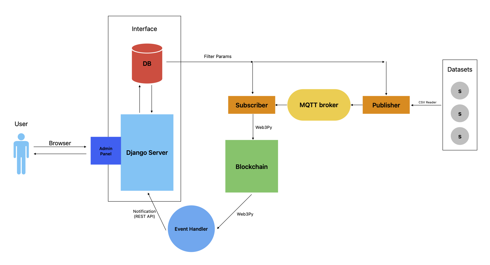

# IoT Blockchain Data Integration

[Used Datasets](docs%2FHomeA-weather.tar.gz) [(HomeA Weather, UMass Smart* Dataset - 2017 release)](https://traces.cs.umass.edu/index.php/Smart/Smart)

## Prerequisites

- Install [Python3.10](https://www.python.org/downloads/) (and pip)

- Install [Ganache](https://trufflesuite.com/ganache/)

- Install Mosquitto Broker
    - Linux:

           $ sudo apt install -y mosquitto
           $ sudo systemctl start mosquitto

    - macOS:

            $ brew install mosquitto
            $ brew services start mosquitto

    - Windows: visit [mosquitto.org](https://mosquitto.org/download/)

- Set virtual environment

    - Linux/macOS:

           $ python3.10 -m venv venv
           $ source venv/bin/activate

    - Windows:

           $ py -3.10 -m venv venv
           $ .\venv\Scripts\activate

- Install Requirements

      $ pip3 install -r requirements.txt

- Django Migrations

      $ cd django_website
      $ python manage.py makemigrations core
      $ python manage.py migrate

- Blockchain

       # Change directory:
       $ cd blockchain/
   
       # Compile Solidity:
       $ python compile_contract.py
   
       # Deploy compiled contract:
       $ python deploy.py
   
       # Run event handler:
       $ python event_handler.py

    - Test event handler by adding data blockchain

           $ python add_sensor_data.py

      Should you see the event message and its data, then blockchain has been successfully set up.

## Run

- Run Mosquitto Broker service on `localhost:1883`

- Run Ganache on `localhost:7545`

- In Terminal

    1. Run django server: `$ python manage.py runserver`

        - visit [Admin Panel](http://localhost:8000/admin/) (username=admin | password=admin)

    2. Run `blockchain/event_handler.py` (pushes notification to django from blockchain)

    3. Run `blockchain/subscriber.py` (subscribes to broker)

    4. Run `blockchain/publisher.py` (publishes to broker)

- Now you should have a data flow!

## Contributors

- [@mohammadsalek (Mohammad Salek)](https://github.com/mohammadsalek)
